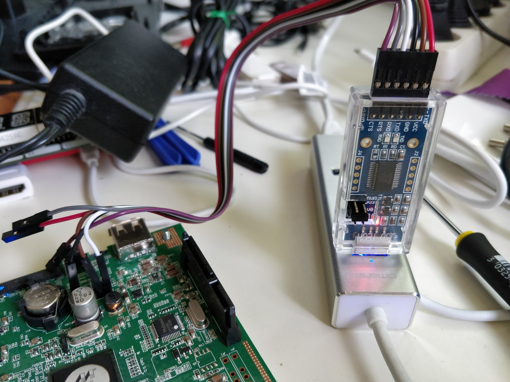

Run Debian on DNS320
--------------------

Everything here comes essentially from:

- https://jamie.lentin.co.uk/devices/dlink-dns325/ : great tutorials how to boot Debian on DNS-320 and how to replace u-boot firmware
- https://github.com/avoidik/board_dns320 : patch files to build u-boot for DNS-320
- https://forum.doozan.com/read.php?3,35295 : patch to fix flaky USB `EHCI timed out on TD - token=`

Other links:
- Firmwares and documentations: ftp://ftp.dlink.eu/Products/dns/dns-320/
- Wikis: http://dns323.kood.org/dns-320
- Linux kernel support: https://www.kernel.org/doc/html/latest/arm/marvel.html
- U-Boot:
  - http://www.denx.de/wiki/U-Boot
  - https://xilinx-wiki.atlassian.net/wiki/spaces/A/pages/18842374/U-Boot+Images
- Managing flash storage with Linux : https://bootlin.com/blog/managing-flash-storage-with-linux/

**My original DLink firmware version: 2.03**

> **DISCLAIMER NOTICE**
> * I'm not responsible for bricked devices, dead SD cards, thermonuclear war, or you getting fired because the alarm app failed (like it did for me...).
> * YOU are choosing to make these modifications, and if you point the finger at me for messing up your device, I will laugh at you.
> * Your warranty will be void if you tamper with any part of your device / software.
> 😘

If you want to:

- Only run chrooted Debian Squeeze from USB key using fun_plug, follow [those instructions](fun_plug.md)
- RECOMMANDED FIRST: Boot Debian from USB key keeping original U-Boot (needs Serial Port use), follow [those instructions](keep_uboot.md)
- Boot Debian from USB key with lastest U-Boot (needs Serial Port use), follow instructions below.

-----------------------------------------------------------------------

# Deboostrap debian

    docker-compose run deboot

> For Debugging/Testing:
>
>     docker-compose run deboot bash
>     ./deboot.sh armel buster http://ftp.fr.debian.org/debian/ openssh-server

# Get USB key ready

## Format to ext2
    
    # Recreate MBR partition
    sudo apt-get install mbr
    sudo install-mbr /dev/sda

    # Create and formate ext2 partition
    # echo ";" | sudo sfdisk /dev/sda
    sudo parted -l
    sudo parted /dev/sda rm 1
    sudo parted /dev/sda mklabel msdos
    sudo parted -a optimal /dev/sda mkpart primary 0% 100%
    #sudo parted -a minimal /dev/sda mkpart primary 0% 100%
    sudo parted /dev/sda set 1 boot on

    sudo mkfs.ext2 /dev/sda1

    # Optionnal, chek bad blocks and fix it
    sudo badblocks -s -w -t 0 /dev/sda1 > badsectors.txt
    sudo e2fsck -y -l badsectors.txt /dev/sda1

    # Force Regular Filesystem Checks (every 30 mounts or 3 months)
    # https://www.xmodulo.com/automatic-filesystem-checks-repair-linux.html
    sudo tune2fs -c 30 -i 3m /dev/sda1
    sudo tune2fs -l /dev/sda1 | egrep 'Maximum|interval'

## Extract Debian

    sudo mkdir -p /mnt/usb/
    sudo mount /dev/sda1 /mnt/usb/
    sudo tar xzf ~/buster-armel.final.tar.gz -C /mnt/usb/
    ls -la /mnt/usb/
    sudo umount /mnt/usb/

> Only boot files:
>
>     sudo tar xzf ~/buster-armel.final.tar.gz -C /mnt/usb/ ./boot

-----------------------------------------------------------------------

# Build U-Boot

    docker-compose run uboot

> Debugging/testing
>
>     docker-compose run uboot bash
>     ./build_uboot.sh

# Serial boot

    screen -L /dev/ttyUSB0 115200

At the `Hit any key to stop autoboot` prompt, press `space` then `1` (can be done before). You should see u-boot prompt:

    Marvel>> 

First, keep current u-boot parameters:

    printenv

> Keep the content of `printenv` [output](infos/printenv.txt). This will be a useful reference if you want to restore any u-boot parameters.

> Hint: press `ctrl + a` then type `:quit` to quit.

# Test new U-Boot with Serial port

> **NB:** Newer stock versions of u-boot cannot boot the original D-link kernels!

    sudo apt-get install u-boot-tools
    kwboot -p -b u-boot.kwb -B115200 -t /dev/ttyUSB0

> From Marwell console, add delays with ping before reboot, so you can switch serial to kwboot
>
>     ping 1;ping 1;reset

Try to boot with following commands :

    setenv ethaddr 14:D6:4D:AB:A7:12
    setenv setbootargs 'setenv bootargs console=${console} ${optargs} ${mtdparts} cmdlinepart.${mtdparts} root=${bootenvroot} rootfstype=${bootenvrootfstype}'
    setenv loadbootenv ext2load usb 0:1 ${loadaddr} ${bootenv}
    boot

> UBIFS partition is not ready yet, it should fail to load from it (see ubifs setup bellow). It should fallback to USB image load.

> New default boot commands try to load `uEnv.txt` from USB FAT partition, just change `loadbootenv` to load from ext2.  
> The `mtdparts` option had became `cmdlinepart.mtdparts` (in Debian-land, at least). [StackExchange](https://unix.stackexchange.com/q/554266)

> Hint: press `ctrl + \` then type `c` to quit.

## `uEnv.txt` configuration

`/uEnv.txt` file is already configured to load Flat Image Tree (FIT) uImage from UBIFS partition first, and fallback to USB on failing.

    optargs=initramfs.runsize=32M usb-storage.delay_use=0 rootdelay=1
    bootenvroot=/dev/disk/by-path/platform-f1050000.ehci-usb-0:1:1.0-scsi-0:0:0:0-part1 rw
    bootenvrootfstype=ext2
    ubifsloadimage=ubi part rootfs && ubifsmount ubi:rootfs && ubifsload ${loadaddr} /uImage
    # Because of flaky USB, load uImage in two parts with some delays
    usbloadimage=sleep 5 && ext4load usb 0:1 0xa00000 /boot/uImage 0xa00000 && sleep 10 && ext4load usb 0:1 0x1400000 /boot/uImage 0 0xa00000 && setenv loadaddr 0xa00000
    bootenvcmd=run setbootargs; run ubifsloadimage || run usbloadimage; bootm ${loadaddr}

> Notes:  
> See `/etc/kernel/postinst.d/zz-local-build-image` created by [`deboot.sh`](scripts/deboot.sh) to know how to build FIT uImage and how it is copied to UBIFS.
>
> `initramfs.runsize` 10% by default, fit it to 32M  
> Because of a bug with `ext2load`, it doesn't work with `pos` argument, use `ext4load` instead...

# Persist new u-boot

If everything is OK, copy `u-boot.kwb` to USB key, then:

    usb reset ; ext2load usb 0:1 0x1000000 /u-boot.kwb
    nand erase 0x000000 0xe0000
    nand write 0x1000000 0x000000 0xe0000
    reset

First, keep current new u-boot parameters:

    printenv

> Keep the content of `printenv` [output](infos/printenv.txt). This will be a useful reference if you want to restore any u-boot parameters.

Reset env ands save them:

    setenv ethaddr 14:D6:4D:AB:A7:12
    setenv setbootargs 'setenv bootargs console=${console} ${optargs} ${mtdparts} cmdlinepart.${mtdparts} root=${bootenvroot} rootfstype=${bootenvrootfstype}'
    setenv loadbootenv ext2load usb 0:1 ${loadaddr} ${bootenv}
    saveenv
    reset

# Setup UBIFS partition

From u-boot shell, create UBI partition and volume:

> **WARNING! following commands erase everything on nand `rootfs` partition**

    nand erase.part rootfs
    ubi part rootfs
    ubi createvol rootfs

Boot debian, then run:

    sudo /etc/kernel/postinst.d/zz-local-build-image $(uname -r)

> It builds uImage and copies it to Nand UBIFS partition

Reboot and u-boot should load uImage from UBIFS partition.

# Load with TFTP

## Load uImage and boot

Source: https://docs.khadas.com/vim3/LoadImagesWithUBootViaTFTP.html

    setenv ipaddr 192.168.1.1
    setenv serverip 192.168.1.2
    tftp 0x0a00000 uImage
    bootm 0x0a00000

## Load u-boot.kwb anf flash

Source: https://docs.khadas.com/vim3/LoadImagesWithUBootViaTFTP.html

    setenv ipaddr 192.168.1.1
    setenv serverip 192.168.1.2
    tftp 0x1000000 u-boot.kwb
    nand erase 0x000000 0xe0000
    nand write 0x1000000 0x000000 0xe0000
    reset

# Swap file

If your memory is full, create a swap file (https://linuxize.com/post/create-a-linux-swap-file/).
Run in your running debian:

    sudo dd if=/dev/zero of=/swapfile bs=1024 count=131072
    sudo chmod 600 /swapfile
    sudo mkswap /swapfile
    sudo swapon /swapfile
    echo '/swapfile swap swap defaults 0 0' | sudo tee -a /etc/fstab

# Monitoring

Kernel logs:

    sudo dmesg

CPU / Memory:

    top
    # or
    htop

I/O:

    sudo iotop

NFS:

    sudo showmount -e
    sudo nfsstat -s
    sudo nfsstat -o net
